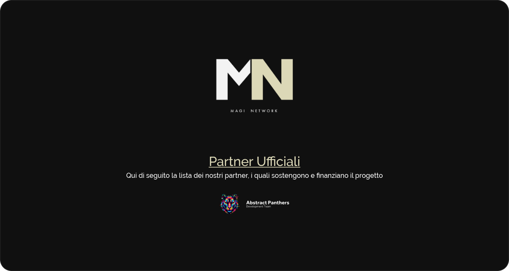

# 🎓 MagiNetwork

## 👋 Benvenuto!
Benvenuto nell'organizzazione ufficiale del **Magi Network**, ovvero un gruppo fondato da studenti dell'**I.T.I.S. Magistri 
Cumacini** dedicato allo sviluppo di progetti _open-source_.

### 👷 Gestori e Amministratori in Carica
Questi sono tutti coloro che si occupano dell'amministrazione del progetto.

#### 📑 Gestori

#### 🛡️ Amministratori

## 📜 Filosofia
Il nostro intento, sul quale ci siamo fondati, è stato quello di creare una piattaforma su cui, programmatori e non solo,
potessero pubblicare i propri progetti, risorse o libri al fine di renderli disponibili ad altri studenti e, così facendo,
ampliare i propri orizzonti di studio.

## ⚒️ Collaborazione
Se sei interessato a collaborare al progetto, fino a nuovo avviso potrai farlo solo inviandoci una mail a 
**contact@maginetwork.org**. Riceverai risposta da un membro del team del nostro partner [Abstract Panthers](https://www.abstractpanthers.com).

Ti ricordiamo che, per poter contribuire, dovrai presentare almeno un progetto valido e che rispetti i nostri termini.

